# Projet Base de Données librairie

  

> **Conception et Implémentation du Système d'Information d'une librairie **  
> Conception - Exploitation BDD (SQL Server)

---

## Table des matières
1. [Contexte et Objectifs](#1-contexte-et-objectifs)
2. [Environnement Technique](#2-environnement-technique)
3. [Déploiement du Schéma (DDL)](#3-déploiement-du-schéma-ddl)
4. [Optimisation (Indexation)](#4-optimisation-indexation)
5. [Tests Fonctionnels & Exploitation (DML)](#5-tests-fonctionnels--exploitation-dml)
6. [Administration & Sécurité](#6-administration--sécurité)
7. [Conclusion](#7-conclusion)

---
## 1. Contexte et Objectifs

La librairie modernise son SI. L'objectif de ce projet est de concevoir une base de données relationnelle centrale capable de gérer :
*   Un catalogue de **80 000+ références** (Livres, Auteurs, Editeurs).
*   Des flux transactionnels complexes (Ventes, Commandes Fournisseurs, Réservations).
*   Une gestion fine des stocks par rayon avec seuils d'alerte.
*   Une sécurité basée sur des rôles utilisateurs (Vendeurs, Stocks, Direction).

---

## 2. Environnement Technique

*   **SGBD** : Microsoft SQL Server 2022 (Express Edition 16.x).
*   **Outils** : SQL Server Management Studio (SSMS).
*   **Langage** : Transact-SQL (T-SQL).

**Initialisation du projet :**
Création de la base et définition du contexte d'exécution.

```sql
CREATE DATABASE TOUTLA_DB;
GO
USE TOUTLA_DB;
GO
```

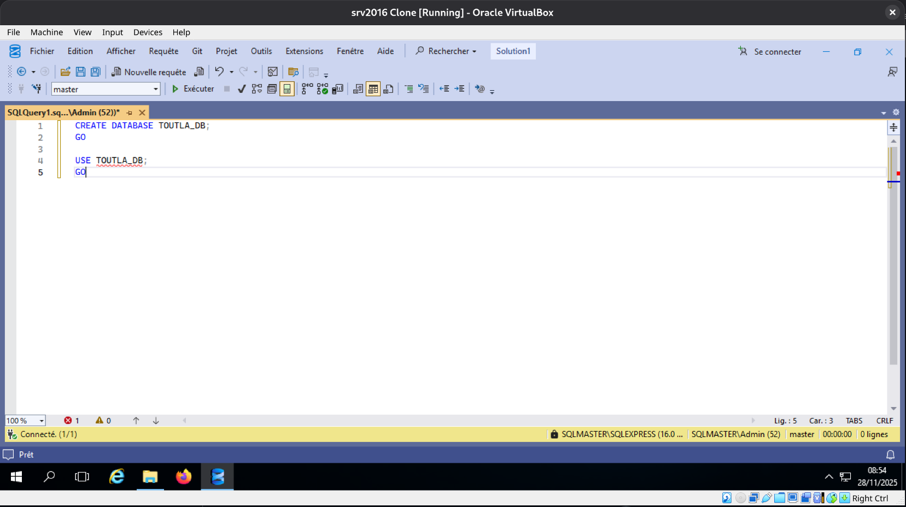
---

## 3. Déploiement du Schéma (DDL)

Le déploiement respecte les contraintes d'intégrité référentielle en créant d'abord les tables "parents" avant les tables "enfants".

### 3.1. Tables de Référence (Niveau 1)
Création des entités indépendantes : `Editeur`, `Auteur`, `Rayon`.

```sql
-- Éditeurs
CREATE TABLE Editeur (
    EditeurID INT IDENTITY(1,1) PRIMARY KEY,
    Nom NVARCHAR(100) NOT NULL,
    Adresse NVARCHAR(255),
    ContactEmail NVARCHAR(100)
);

-- Auteurs
CREATE TABLE Auteur (
    AuteurID INT IDENTITY(1,1) PRIMARY KEY,
    Nom NVARCHAR(100) NOT NULL,
    Prenom NVARCHAR(100),
    Biographie NVARCHAR(MAX)
);

-- Rayons
CREATE TABLE Rayon (
    RayonID INT IDENTITY(1,1) PRIMARY KEY,
    Nom NVARCHAR(50) NOT NULL,
    Description NVARCHAR(255)
);
```

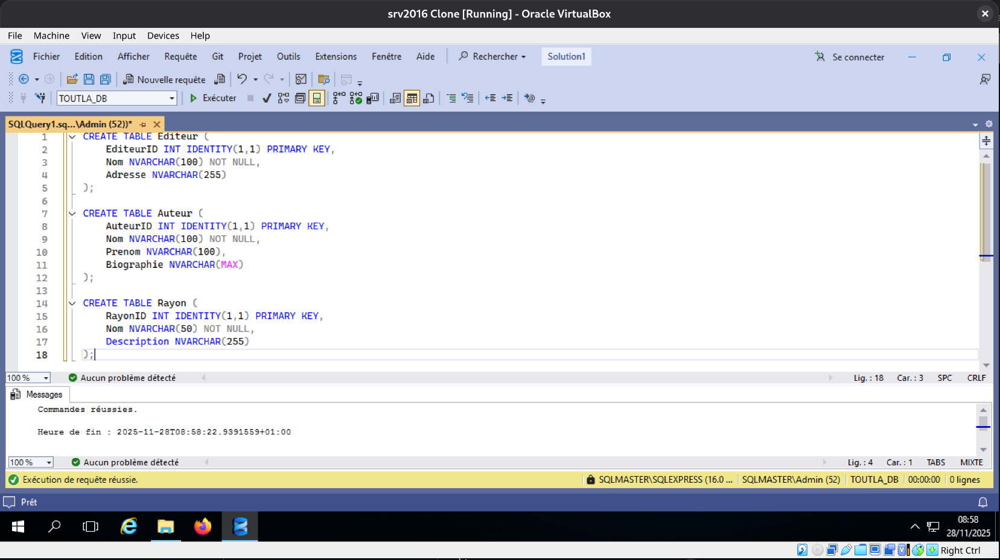

### 3.2. Tables Principales (Niveau 2)
Création des tables `Livre` et `Client`.
> **Note technique** : Mise en place de contraintes `CHECK` (prix positif) et `UNIQUE` (email client) pour garantir la qualité des données dès l'insertion.

```sql
-- Livres
CREATE TABLE Livre (
    ISBN VARCHAR(13) PRIMARY KEY,
    Titre NVARCHAR(200) NOT NULL,
    Resume NVARCHAR(MAX),
    PrixHT DECIMAL(10, 2) NOT NULL,
    DateParution DATE,
    Langue NVARCHAR(50) DEFAULT 'Français',
    Format NVARCHAR(50),
    SeuilAlerte INT DEFAULT 5,
    EditeurID INT NOT NULL,
    RayonID_Principal INT NOT NULL,
    CONSTRAINT FK_Livre_Editeur FOREIGN KEY (EditeurID) REFERENCES Editeur(EditeurID),
    CONSTRAINT FK_Livre_Rayon FOREIGN KEY (RayonID_Principal) REFERENCES Rayon(RayonID),
    CONSTRAINT CK_Prix_Positif CHECK (PrixHT >= 0)
);

-- Clients
CREATE TABLE Client (
    ClientID INT IDENTITY(1,1) PRIMARY KEY,
    Nom NVARCHAR(100) NOT NULL,
    Prenom NVARCHAR(100),
    TypeClient CHAR(13) NOT NULL, -- 'Particulier' or 'Professionnel'
    Email NVARCHAR(150) NOT NULL UNIQUE,
    Telephone VARCHAR(20),
    NumFidelite VARCHAR(20),
    RemisePro DECIMAL(4, 2) DEFAULT 0,
    DateCreation DATETIME DEFAULT GETDATE(),
    Siret VARCHAR(50),
    Adresse NVARCHAR(255),
    CodePostal VARCHAR(10),
    Ville NVARCHAR(100),
    CarteFidelite BIT DEFAULT 0
);
```

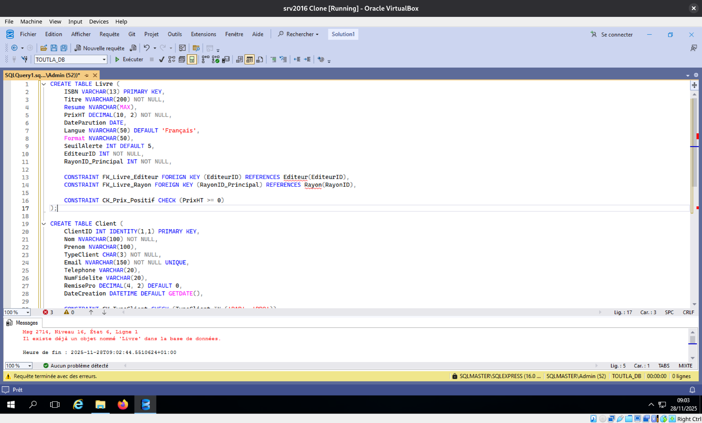

### 3.3. Tables Transactionnelles et d'Association (Niveau 3)
Mise en place des relations Many-to-Many (`Livre_Auteur`) et des tables de flux (`Vente`, `Stock`).

```sql
-- Liaison Livre-Auteur
CREATE TABLE Livre_Auteur (
    ISBN VARCHAR(13) NOT NULL,
    AuteurID INT NOT NULL,
    PRIMARY KEY (ISBN, AuteurID),
    CONSTRAINT FK_LA_Livre FOREIGN KEY (ISBN) REFERENCES Livre(ISBN),
    CONSTRAINT FK_LA_Auteur FOREIGN KEY (AuteurID) REFERENCES Auteur(AuteurID)
);

-- Stock
CREATE TABLE Stock (
    RayonID INT NOT NULL,
    ISBN VARCHAR(13) NOT NULL,
    Quantite INT NOT NULL DEFAULT 0,
    Emplacement VARCHAR(50),
    PRIMARY KEY (RayonID, ISBN),
    CONSTRAINT FK_Stock_Rayon FOREIGN KEY (RayonID) REFERENCES Rayon(RayonID),
    CONSTRAINT FK_Stock_Livre FOREIGN KEY (ISBN) REFERENCES Livre(ISBN),
    CONSTRAINT CK_Stock_Positif CHECK (Quantite >= 0)
);
```

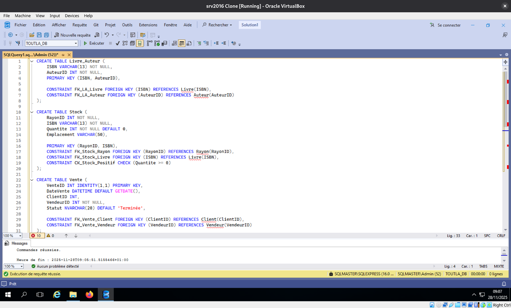

### 3.4. Validation de la structure
Vérification visuelle dans l'explorateur d'objets SSMS pour confirmer que l'ensemble du schéma `dbo` est conforme au MCD.

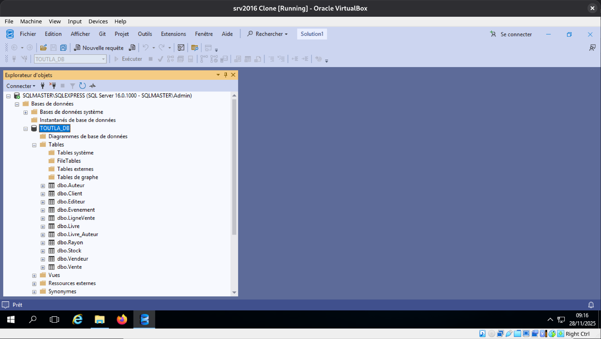

---

## 4. Optimisation (Indexation)

Afin de garantir les performances sur les gros volumes (80k références), des index non-clustered ont été ajoutés sur les colonnes de recherche fréquentes (`Titre`, `DateVente`, `NomClient`).

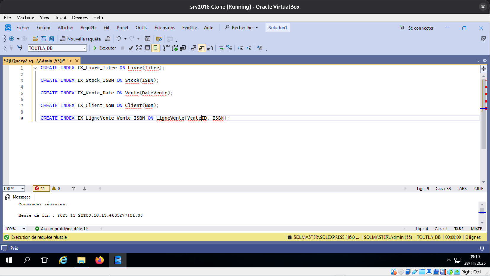

---

## 5. Tests Fonctionnels & Exploitation (DML)

Un jeu de données complet (simulant l'année 2025) a été injecté. Voici les preuves de fonctionnement des règles de gestion.

### 5.1. Validation des Jointures (Catalogue)
Test de récupération d'un livre avec son auteur et son rayon.

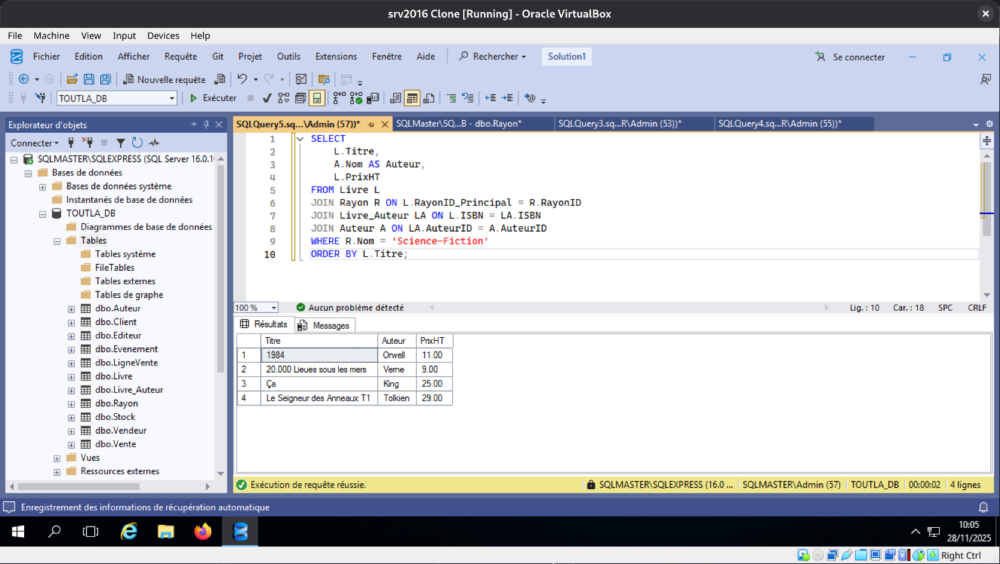

### 5.2. Historique Client
**Objectif** : Récupérer tout l'historique d'achat d'un client spécifique.
**Requête** : Jointure `Client` -> `Vente` -> `LigneVente` -> `Livre`.

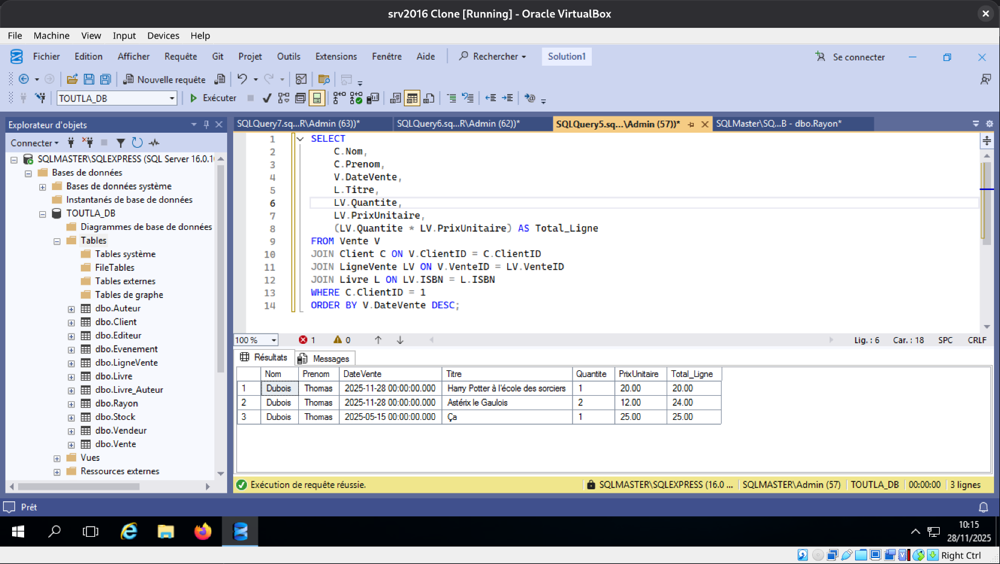

### 5.3. Analyse du Chiffre d'Affaires
**Objectif** : Aggrégation des ventes par mois pour suivi comptable.

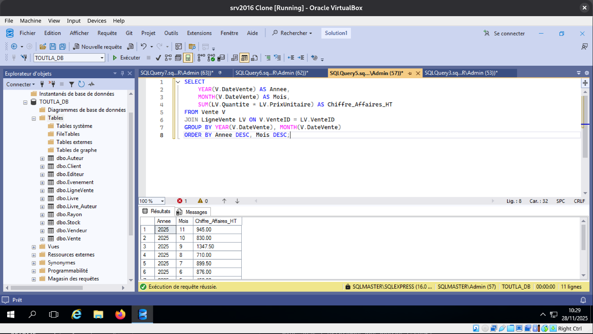

### 5.4. Gestion des Événements
**Objectif** : Planning des événements futurs (Dédicaces, Rencontres).

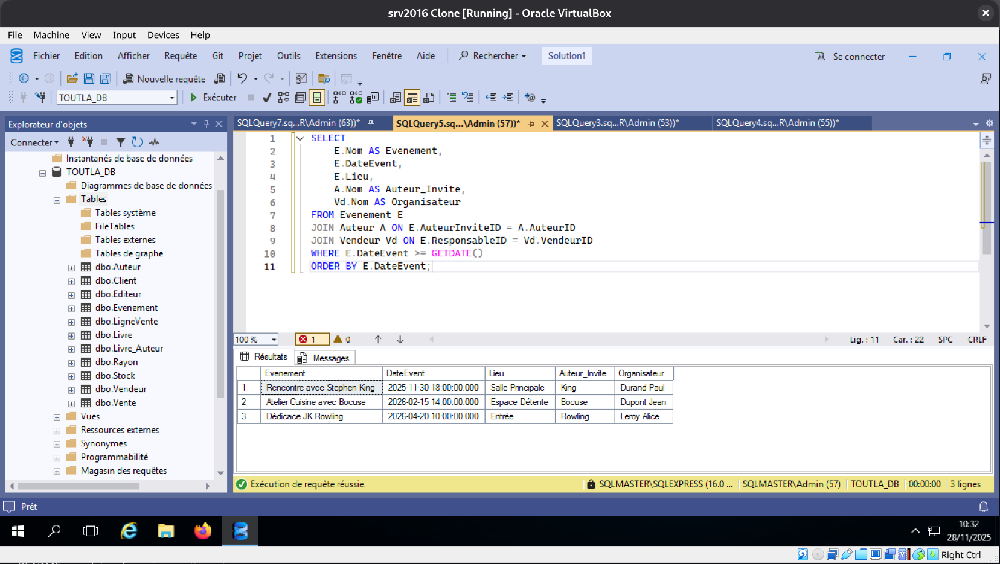

### 5.5. Top Clients (Bonus)
**Objectif** : Identifier les meilleurs clients (notamment les écoles/pros).

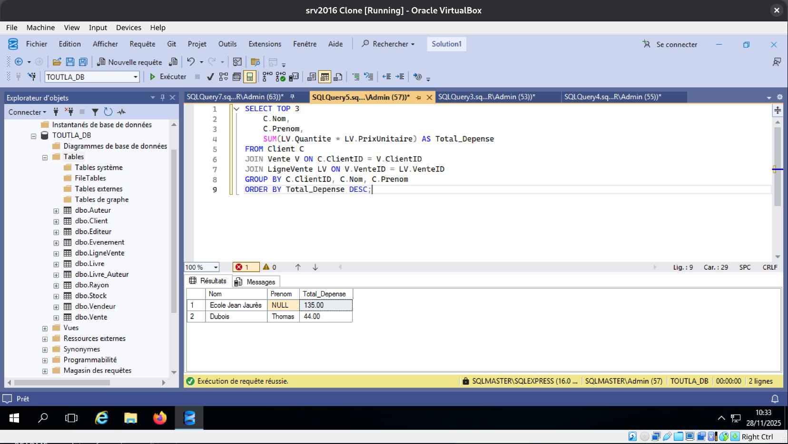

### 5.6. Alerte Stock Critique
**Objectif** : Vue automatique remontant les livres sous le seuil d'alerte.

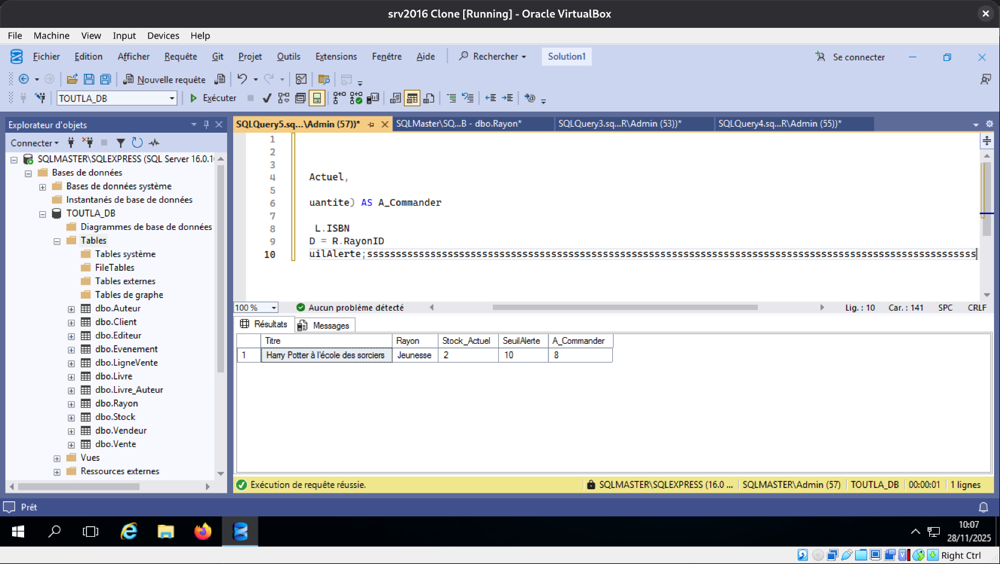

---

## 6. Administration & Sécurité

### 6.1. Vues et Procédures Stockées
Création d'objets pour simplifier l'accès aux données (Vue Stock) et pour les exports (Procédure Export CSV).

```sql
-- Vue Stock Critique
CREATE OR ALTER VIEW Vue_StockCritique AS
SELECT L.ISBN, L.Titre, E.Nom AS Editeur, S.Quantite AS Stock_Actuel, L.SeuilAlerte
FROM Stock S
JOIN Livre L ON S.ISBN = L.ISBN
JOIN Editeur E ON L.EditeurID = E.EditeurID
WHERE S.Quantite <= L.SeuilAlerte;
GO

-- Procédure Historique Client
CREATE OR ALTER PROCEDURE GetHistoriqueClient 
    @ClientID INT
AS
BEGIN
    SELECT 
      C.Nom, C.Prenom, V.DateVente, L.Titre, LV.Quantite, LV.PrixUnitaire,
      (LV.Quantite * LV.PrixUnitaire) AS Total_Ligne
    FROM Vente V
    JOIN Client C ON V.ClientID = C.ClientID
    JOIN LigneVente LV ON V.VenteID = LV.VenteID
    JOIN Livre L ON LV.ISBN = L.ISBN
    WHERE C.ClientID = @ClientID
    ORDER BY V.DateVente DESC;
END;
GO

-- Procédure Export CSV
CREATE OR ALTER PROCEDURE ExportVentesCSV AS
BEGIN
  SELECT FORMAT(V.DateVente, 'dd/MM/yyyy') AS [Date],
         CAST(LV.Quantite * LV.PrixUnitaire AS DECIMAL(10,2)) AS [Montant_HT],
         CAST((LV.Quantite * LV.PrixUnitaire) * 0.055 AS DECIMAL(10,2)) AS [TVA_5_5],
         CAST((LV.Quantite * LV.PrixUnitaire) * 1.055 AS DECIMAL(10,2)) AS [Montant_TTC],
         C.ClientID AS [Code_Client],
         LV.ISBN AS [Code_Produit]
  FROM Vente V
  JOIN LigneVente LV ON V.VenteID = LV.VenteID
  JOIN Client C ON V.ClientID = C.ClientID
  ORDER BY V.DateVente ASC, C.ClientID ASC;
END;
GO
```

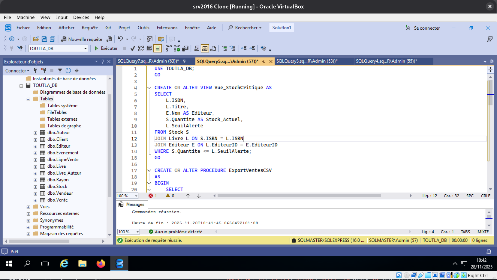

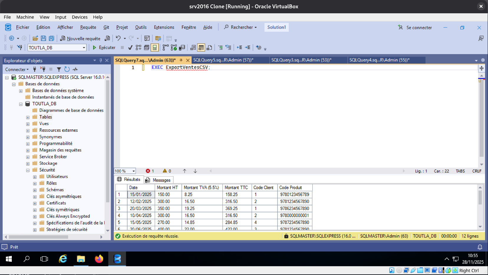

### 6.2. Sécurité (Rôles)
Implémentation du principe de moindre privilège avec 3 rôles distincts :
*   `Role_Vente`
*   `Role_Gestion_Stock`
*   `Role_Communication`

```sql
CREATE ROLE Role_Vente;
CREATE ROLE Role_Gestion_Stock;
CREATE ROLE Role_Communication;

GRANT SELECT, INSERT ON Vente TO Role_Vente;
GRANT SELECT, INSERT ON LigneVente TO Role_Vente;
GRANT SELECT ON Client TO Role_Vente;
GRANT EXECUTE ON GetHistoriqueClient TO Role_Vente;

GRANT SELECT, UPDATE, INSERT ON Stock TO Role_Gestion_Stock;
GRANT SELECT ON Vue_StockCritique TO Role_Gestion_Stock;

GRANT SELECT, INSERT, UPDATE ON Evenement TO Role_Communication;
```

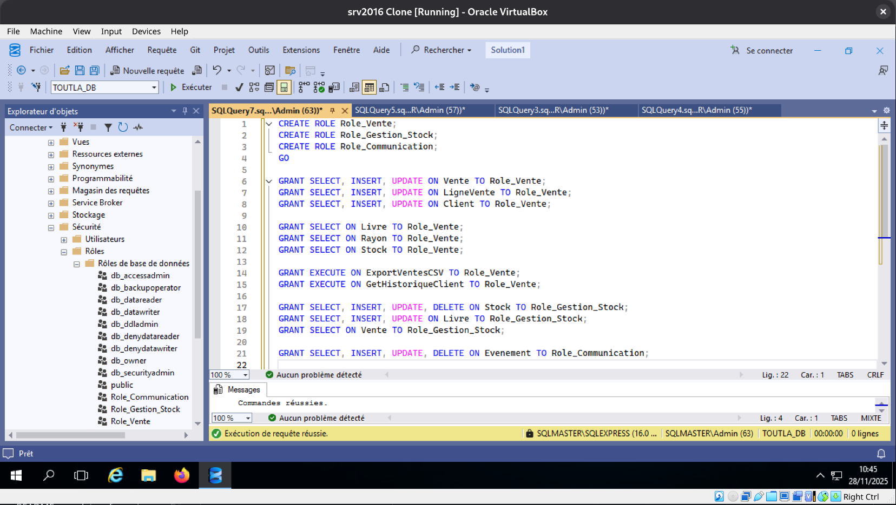

### 6.3. Plan de Sauvegarde
Stratégie mise en place : Sauvegarde Complète (Hebdo) + Différentielle.

```sql
BACKUP DATABASE TOUTLA_DB TO DISK = 'C:\Backups\TOUTLA_Full.bak' WITH FORMAT;
BACKUP DATABASE TOUTLA_DB TO DISK = 'C:\Backups\TOUTLA_Diff.bak' WITH DIFFERENTIAL;
```

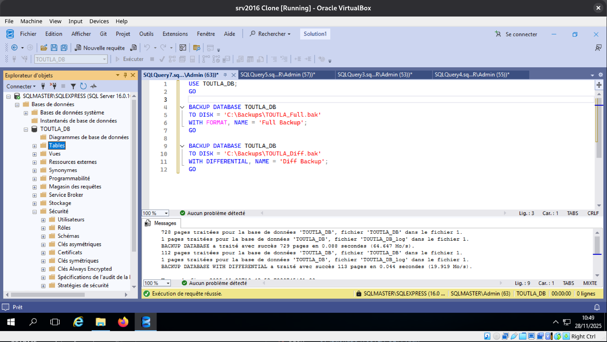

---

## 7. Conclusion

Le projet répond à l'ensemble des exigences du cahier des charges "TOUTLA" :
1.  **Intégrité des données** assurée par un schéma normalisé (3FN).
2.  **Performance** garantie par une stratégie d'indexation ciblée.
3.  **Sécurité** gérée nativement via les rôles SQL Server.
4.  **Exploitabilité** facilitée par des vues et procédures stockées dédiées.

